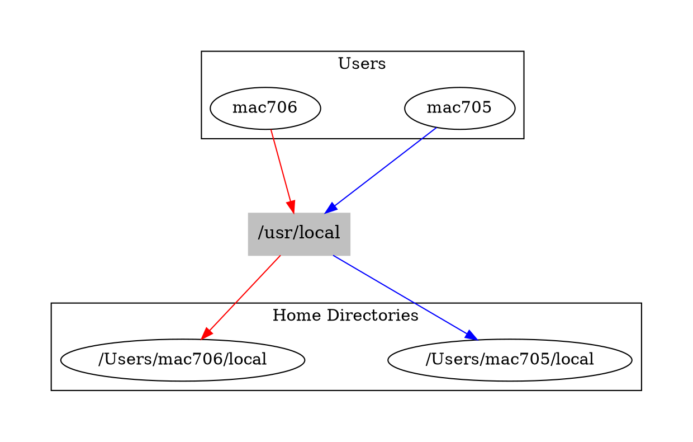
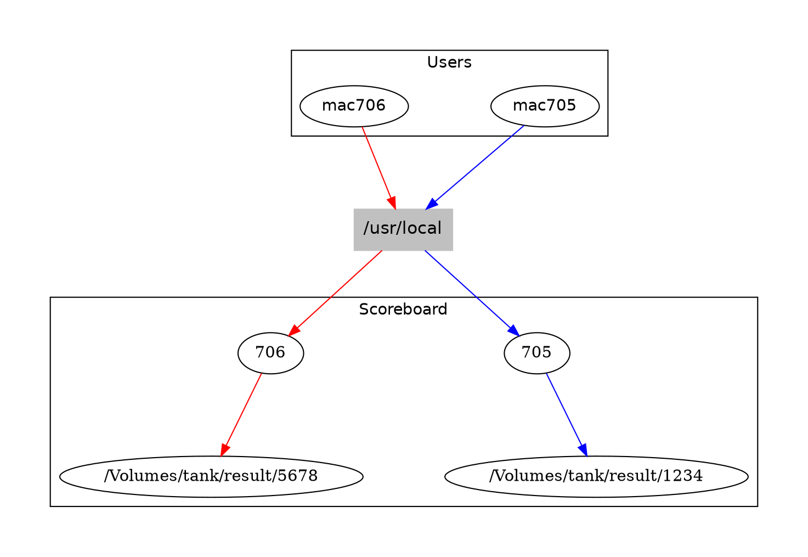

OCluster/OBuilder macOS Infrastructure
--------------------------------------

This document tells the ongoing story of supporting macOS in OCaml's Continuous Integration (CI) tools.

## The Big Picture

[OCurrent](https://github.com/ocurrent/ocurrent) is an OCaml library for building incremental pipelines. Pipelines can be thought of as directed graphs with each node being some kind of job that feeds its results into the next node. For an example, have a look at [the OCaml deploy pipeline](https://deploy.ci.ocaml.org/). 

An integral part to most of the [OCaml pipelines](https://github.com/ocurrent/overview) is something called [OCluster](https://github.com/ocurrent/ocluster) and [OBuilder](https://github.com/ocurrent/obuilder). OCluster is a library and collection of binaries for managing an infrastructure for building and scheduling jobs. These jobs could be Docker jobs or OBuilder jobs. OBuilder is quite similar to `docker build` but written in OCaml and using just a notion of *an execution environment* (on Linux [runc](https://github.com/opencontainers/runc)) and a *snapshotting filesystem* ([btrfs](https://btrfs.wiki.kernel.org/index.php/Main_Page), [zfs](https://openzfs.org/wiki/Main_Page) or an inefficient but convenient copying backend using `rsync`). 

The big picture, and focus of this document, is adding support for building macOS OBuilder jobs. It's important to note the narrow scope of the project -- for this iteration we just need to build [opam](https://opam.ocaml.org) packages.

## The Implementation

### Overview

The main problem we are tackling is that macOS has *no notion or support of native containers*. You can have multiple users on a single machine each with their own home directory and ability to execute commands and a way of identifying who they are (their `uid`). This is how the macOS implementation of OBuilder's `SANDBOX` is built. Individual users can be created for each build and in the future `sandbox-exec` can help to restrict what they have access to.

### Snapshotting Filesystem

On macOS there is a [port of ZFS](https://openzfsonosx.org/) that, at the time, works quite well but not perfectly. Many hours were lost debugging what ended up being small bugs in ZFS. This is what inspired adding a very portable and reliable, but slow and memory-inefficient [`rsync` store backend](https://github.com/ocurrent/obuilder/pull/88). This is what is currently used in the macOS implementation.

### Global System Dependencies

Opam, the OCaml package manager, is happy to have multiple opam roots on a system typically in the home directory of the user (`~/.opam`). This is great as running something like `sudo -u macos-builder-705 -i /bin/bash -c 'opam install irmin'` will use `macos-builder-705`'s home directory to build `irmin`. This provides an illusion of isolation similar to `runc`.

Homebrew however, a macOS system package manager, is not so willing to be installed anywhere. [You can do it](https://docs.brew.sh/Installation#untar-anywhere), but as they say:

> However do yourself a favour and install to /usr/local on macOS Intel, /opt/homebrew on macOS ARM ... Pick another prefix at your peril!

### Tricking Homebrew with FUSE

We want to have multiple Homebrew installations that all believe they are installed in `/usr/local`. Without this, homebrew can't use "bottles" which are pre-built binaries making building much faster.

The proposed solution is to mount a FUSE (filesystem in userspace) filesystem onto `/usr/local` which intercepts calls and redirects them based on who the calling user is.



FUSE luckily supplies all commands with a `fuse_context` which provides the `uid` of the calling user. We can use this to redirect to the correct home directory. This is what the [obuilder-fs](https://github.com/patricoferris/obuilder-fs) filesystem does. The implementation ensures that it is mounted and all calls to `/usr/local` are redirected. This does have some cost, but in practice most packages make use of a few core system dependencies.

### Rsyncing to Home

With the scheme described above, each user's home directory is easy to find as it is based on the `uid`. One problem though is that for each build step (`run`, `copy`...) we take a snapshot so we can later restore from it. This means we need to sync the home directory with the snapshot. This is also important for packages that are not relocatable (at the time of writing `ocamlfind` is an example).

The workaround is to `rsync` the snapshot from the store to the user's home directory every time we execute a step. This is exactly what happens in this [code in the macOS sandbox implementation](https://github.com/patricoferris/obuilder/blob/8c3f200b519ad14a5f70787e42f59ec7db229d3c/lib/sandbox.macos.ml#L61).

We also use a `scoreboard` directory to let FUSE map UIDs to home directories. This might actually be more of an artefact now that the implementation preserves the directory used to build throughout the execution.



### Docker-esque Base Images

OBuilder spec files start with a `(from ...)` stage. This identifies the image that should be used as a basis for the build. In OCaml-related projects this tends to be one of the [docker base images](https://base-images.ocamllabs.io/).

In order to minimise the amount of additional logic that would be needed for macOS inside things like [ocaml-ci](https://ci.ocamllabs.io/), [opam-repo-ci](https://github.com/ocurrent/opam-repo-ci) and [opam-health-check](http://check.ocamllabs.io/), it makes sense for the macOS version to be as similar as possible to the docker base images. 

This includes: 

 - Having both `opam.2.0.X` and `opam.2.1.X` installed and ready to use by sym-linking to `/usr/local/bin/opam`. 
 - Being clever (thanks @kit-ty-kate) with the `.bash_profile` script to reuse the name of the base image (i.e. `(from "macos-homebrew-ocaml-4.11")`) to setup things like the path to the system compiler. This means the Obuilder specs don't need to worry about the OCluster worker implementation details.

Given what macOS actually needs is a directory ready to copy into the home directory of the user, there's also a [simple copying implementation of this initial `(from ...)` stage (the `FETCHER`)](https://github.com/patricoferris/obuilder/blob/macos-v2/lib/user_temp.ml). However, the Docker fetcher also works if the image is formatted in particular way, more on this below.

## OCluster macOS Worker

Relevant PR: https://github.com/ocurrent/ocluster/pull/152

### Building a macOS Base Directory

This repository contains an OCaml executable (`main.ml`) for building macOS "base directories". Primarily, this installs Homebrew and opam and actually reuses the macOS OBuilder backend to do so. You can see from the spec file described in `main.ml` that sometimes we need to be careful with paths in macOS spec files. Only `/usr/local` is remapped so absolute paths anywhere else will all be shared and should not be allowed.

We still use system compilers installed on the worker machine. The OBuilder implementation always sources a `.obuilder_profile.sh` file before building. There we can ensure the correct `PATH` is set. To easily install system compilers (for different versions of the compiler) there is [the opam-sysinstall plugin](https://github.com/patricoferris/opam-sysinstall).

To build a new base directory you can run:

```
sudo dune exec -- ./main.exe --ocaml-version=4.14.0 --rsync=/Volumes/rsync --uid=705 --fallback=/Users/administrator/lib --scoreboard=/Users/administrator/scoreboard --verbosity=info
```

The final build will be in `/Users/mac705` (or in the final snapshot in the rsync store). If you want to user the `User_temp` copying `FETCHER` then you can

```
sudo rsync -aHq /Users/mac705/ /Users/macos-homebrew-ocaml-4.13
```

And use this from stage in your spec file `(from macos-homebrew-ocaml-4.13)`. Note that the OCluster PR still uses the Docker fetcher in the PR but not on the machines. The machines have the following small patch that hopefully in the future can be removed.

```diff
diff --git a/obuilder b/obuilder
--- a/obuilder
+++ b/obuilder
@@ -1 +1 @@
-Subproject commit 9c910f0693e938b491d3ba5ba09b43a4469b7c2d
+Subproject commit 9c910f0693e938b491d3ba5ba09b43a4469b7c2d-dirty
diff --git a/worker/obuilder_build.ml b/worker/obuilder_build.ml
index 9cebd2b..0a0af6d 100644
--- a/worker/obuilder_build.ml
+++ b/worker/obuilder_build.ml
@@ -22,7 +22,7 @@ type t = {
 }

 module Sandbox = Obuilder.Sandbox
-module Fetcher = Obuilder.Docker
+module Fetcher = Obuilder.User_temp

 let ( / ) = Filename.concat
```

The Docker `FETCHER` does work but we don't have a [base-images](https://github.com/ocurrent/docker-base-images) equivalent to keep things up to date yet. To make a compatible Docker image you can run `docker build` with the following Dockerfile:

```Dockerfile
FROM scratch
COPY ./mac705-macos-homebrew-ocaml-4.14 /
CMD [ "/bin/bash" ]
```

And push the image.

### Thanks

For the most part, I was simply the person implementing macOS CI. Much more experienced people very gladly helped answer all of my questions: thanks @talex5, @dra27, @avsm, @kit-ty-kate, @MagnusS, @MisterDA, @tmcgilchrist and @mtelvers.

